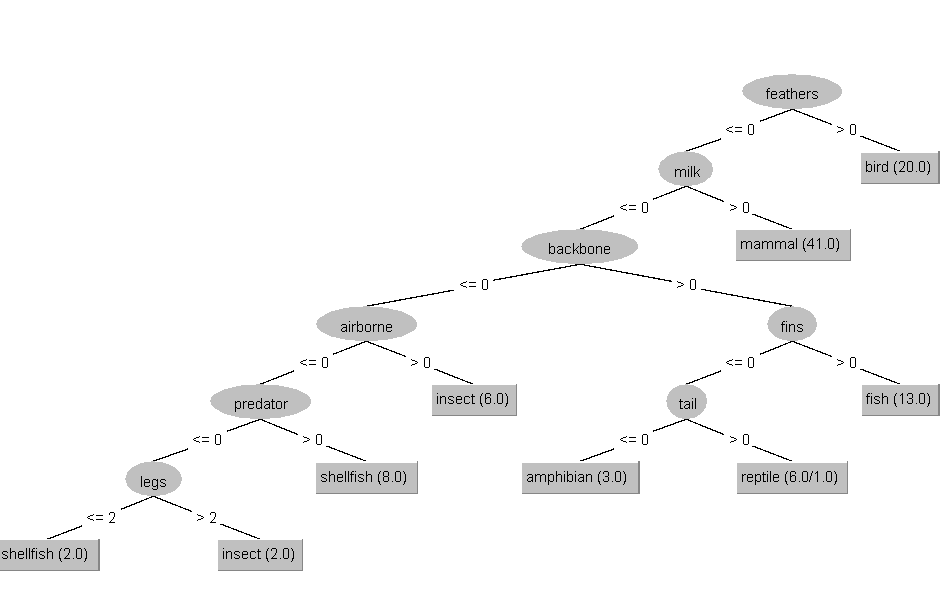
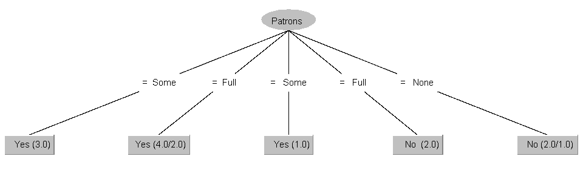
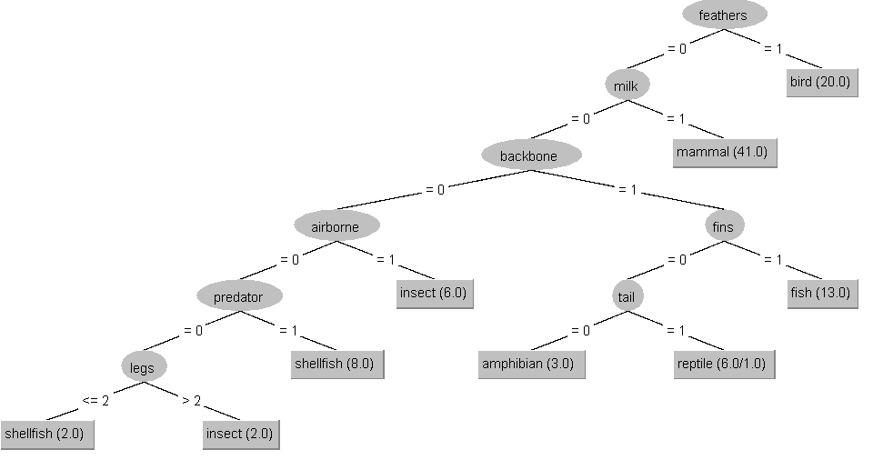
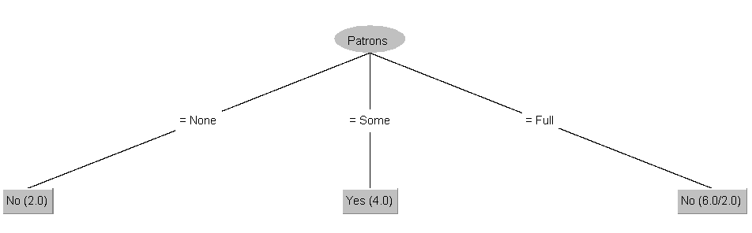

# Entscheidungbäume (Decision Tree Learner DTL)

## Entscheindungsbäume mit CAL3 und ID3

| Nr. | Alter    | Einkommen | Bildung  | Kandidat |
|:----|:---------|:----------|:---------|:---------|
| 1   | $\ge 35$ | hoch      | Abitur   | O        |
| 2   | $< 35$   | niedrig   | Master   | O        |
| 3   | $\ge 35$ | hoch      | Bachelor | M        |
| 4   | $\ge 35$ | niedrig   | Abitur   | M        |
| 5   | $\ge 35$ | hoch      | Master   | O        |
| 6   | $< 35$   | hoch      | Bachelor | O        |
| 7   | $< 35$   | niedrig   | Abitur   | M        |

### CAL3

$S_1 = 4$
$S_2 = 0.7$

| Nr. | $a$                                        |
| :-- | :----------------------------------------- |
| 0   | *                                          |
| 1   | /O1/                                       |
| 2   | /O2/                                       |
| 3   | /O2M1/                                     |
| 4   | /O2M2/                                     |
| -   | $x_1$(*,/M1/)                              |
| 5   | $x_1$(*,/O1M1/)                            |
| 6   | $x_1$(/O1/,/O1M1/)                         |
| 7   | $x_1$(/O1M1/,/O1M1/)                       |
| 1   | $x_1$(/O1M1/,/O2M1/)                       |
| 2   | $x_1$(/O2M1/,/O2M1/)                       |
| 3   | $x_1$(/O2M1/,/O2M2/)                       |
| -   | $x_1$(/O2M1/,$x_2$(*,/M1/))                |
| 4   | $x_1$(/O2M1/,$x_2$(/M1/,/M1/))             |
| 5   | $x_1$(/O2M1/,$x_2$(/M1/,/M1O1/))           |
| 6   | $x_1$(/O3M1/,$x_2$(/M1/,/M1O1/))           |
| -   | $x_1$(O,$x_2$(/M1/,/M1O1/))                |
| 7   | -                                          |
| 1   | $x_1$(O,$x_2$(/M1/,/M1O2/))                |
| 2   | -                                          |
| 3   | $x_1$(O,$x_2$(/M1/,/M2O2/))                |
| -   | $x_1$(O,$x_2$(/M1/,$x_3$(*,/M1/,*)))       |
| 4   | $x_1$(O,$x_2$(/M2/,$x_3$(*,/M1/,*)))       |
| 5   | $x_1$(O,$x_2$(/M2/,$x_3$(*,/M1/,/O1/)))    |
| 6   | -                                          |
| 7   | -                                          |
| 1   | $x_1$(O,$x_2$(/M2/,$x_3$(/O1/,/M1/,/O1/))) |
| 2   | -                                          |
| 3   | $x_1$(O,$x_2$(/M2/,$x_3$(/O1/,/M2/,/O1/))) |
| 4   | $x_1$(O,$x_2$(/M3/,$x_3$(/O1/,/M2/,/O1/))) |
| 5   | $x_1$(O,$x_2$(/M3/,$x_3$(/O1/,/M2/,/O2/))) |
| 6   | -                                          |
| 7   | -                                          |
| 1   | $x_1$(O,$x_2$(/M3/,$x_3$(/O2/,/M2/,/O2/))) |
| 2   | -                                          |
| 3   | $x_1$(O,$x_2$(/M3/,$x_3$(/O2/,/M3/,/O2/))) |
| 4   | $x_1$(O,$x_2$(/M4/,$x_3$(/O2/,/M3/,/O2/))) |
| -   | $x_1$(O,$x_2$(M,$x_3$(/O2/,/M3/,/O2/)))    |
| 5   | $x_1$(O,$x_2$(M,$x_3$(/O2/,/M3/,/O3/)))    |
| 6   | -                                          |
| 7   | -                                          |
| 1   | $x_1$(O,$x_2$(M,$x_3$(/O3/,/M3/,/O3/)))    |
| 2   | -                                          |
| 3   | $x_1$(O,$x_2$(M,$x_3$(/O3/,/M4/,/O3/)))    |
| -   | $x_1$(O,$x_2$(M,$x_3$(/O3/,M,/O3/)))       |
| 4   | -                                          |
| 5   | $x_1$(O,$x_2$(M,$x_3$(/O3/,M,/O4/)))       |
| -   | $x_1$(O,$x_2$(M,$x_3$(/O3/,M,O)))          |
| 6   | -                                          |
| 7   | -                                          |
| 1   | $x_1$(O,$x_2$(M,$x_3$(/O4/,M,O)))          |
| -   | $x_1$(O,$x_2$(M,$x_3$(O,M,O)))             |
| 2   | -                                          |
| 3   | -                                          |
| 4   | -                                          |
| 5   | -                                          |
| 6   | -                                          |
| 7   | -                                          |

### ID3

#### Entropy

$H = -\frac{4}{7}\log_2\frac{4}{7} - \frac{3}{7}\log_2\frac{3}{7}$  
$H \approx 0.986$

#### Alter

$H(<35) = -\frac{2}{3}\log_2\frac{2}{3} - \frac{1}{3}\log_2\frac{1}{3}$
$H(<35) \approx 0.918$
$H(\ge35) = -\frac{1}{2}\log_2\frac{1}{2} - \frac{1}{2}\log_2\frac{1}{2}$ 
$H(\ge35) \approx 1$

$H(Alter) = \frac{3}{7}*0.918 + \frac{4}{7}*1$
$H(Alter) \approx 0.964$

$Gain(H, H(Alter)) = 0.986-0.964$
$Gain(H, H(Alter)) \approx 0.022$

#### Einkommen

$H(Hoch) = -\frac{3}{4}\log_2\frac{3}{4} - \frac{1}{4}\log_2\frac{1}{4}$  
$H(Hoch) \approx 0.811$

$H(Niedrig) = -\frac{1}{3}\log_2\frac{1}{3} - \frac{2}{3}\log_2\frac{2}{3}$  
$H(Niedrig) \approx 0.918$

$H(Einkommen) = \frac{4}{7}*0.811 + \frac{3}{7}*0.918$
$H(Einkommen) \approx 0.857$

$Gain(H, H(Einkommen)) = 0.986-0.857$
$Gain(H, H(Einkommen)) \approx 0.129$

#### Bildung

$H(Abitur) = -\frac{2}{3}\log_2\frac{2}{3} - \frac{1}{3}\log_2\frac{1}{3}$  
$H(Abitur) \approx 0.918$

$H(Bachelor) = -\frac{1}{2}\log_2\frac{1}{2} - \frac{1}{2}\log_2\frac{1}{2}$
$H(Bachelor) \approx 1$

$H(Master) = -1*\log_2(1)$
$H(Master) = 0$

$H(Bildung) = \frac{3}{7}*0.918 + \frac{2}{7}*1 + \frac{2}{7}*0$
$H(Bildung) \approx 0.679$

$Gain(H, H(Bildung)) = 0.986-0.679$
$Gain(H, H(Bildung)) \approx 0.305$

#### Ergebnis

$x_3(x_2(M,O),x_1(O,M),O)$

## Pruning

- $x_3(x_2(x_1(C,A),x_1(B,A)), x_1(x_2(C,B),A))$  
- $x_3(x_1(x_2(C,B),A), x_1(x_2(C,B),A))$  
- $x_1(x_2(C,B),A)$  

## Machine Learning mit Weka

### 1

#### Zoo

#### Restaurant

### 2

- ordinal/numeric: Zahlen
- string: Text
- nominal: vordefinierte Menge von Strings

### 3

#### J48

#### Restaurant ID3

Patrons = Some: Yes  
Patrons = Full  
|  Type = French: No  
|  Type = Thai  
|  |  Fri/Sat = No: No  
|  |  Fri/Sat = Yes: Yes  
|  Type = Burger  
|  |  YesAlternate = Yes: Yes  
|  |  YesAlternate = No: No  
|  Type = Italian: No  
Patrons = None: No  
