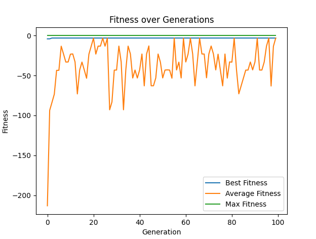
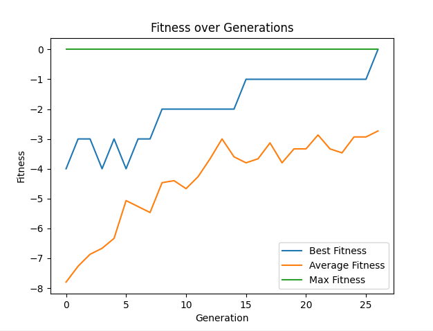

# Lokale Suche, GA

## Modelierung von GA

### Landkarten Färbeproblem

Regionen der Landkarte sollen so gefärbt werden, dass benachbarte Regionen unterschiedliche Farben haben. Ziel ist es, so wenige Farben wie möglich zu verwenden.

**Kodierung:**

```python
    [1, 5, 4, 2, 3, 1]
```

Jede Stelle im Array repräsentiert eine Region, und die Zahl an dieser Stelle gibt die Farbe der Region an.

**Operator:**

Crossover: Es werden zwei Elternlösungen ausgewählt, und ein Crossover-Punkt wird zufällig gewählt. Die Farben der Regionen werden bis zu diesem Punkt von einem Elternteil übernommen, und die restlichen Farben vom anderen Elternteil.

Mutation: Mit einer bestimmten Wahrscheinlichkeit wird die Farbe einer zufällig ausgewählten Region geändert.

**Fitness-Funktion:**

$$
    F = -(Conflicts * 100 + UsedColors)
$$

Lösungen mit weniger Konflikten und weniger verwendeten Farben erhalten einen höheren Fitness-Score. Die Konflikte werden höher gewichtet, um sicherzustellen, dass gültige Färbungen bevorzugt werden.

### 8-Queens-Problem

Königinnen sollen auf einem 8x8 Schachbrett so platziert werden, dass keine zwei Königinnen sich gegenseitig angreifen können.

**Kodierung:**

```python
    [0, 4, 7, 5, 2, 6, 1, 3]
```

Jede Stelle im Array repräsentiert eine Zeile des Schachbretts, und die Zahl an dieser Stelle gibt die Spalte an, in der die Königin in dieser Spalte platziert ist.

**Operator:**

Crossover: Zwei Elternlösungen werden ausgewählt, und ein Crossover-Punkt wird zufällig gewählt. Die Positionen der Königinnen werden bis zu diesem Punkt von einem Elternteil übernommen, und die restlichen Positionen vom anderen Elternteil.

Mutation: Mit einer bestimmten Wahrscheinlichkeit wird die Position einer Königin in ihrer Zeile geändert.

**Fitness-Funktion:**

$$
    F = -Conflicts
$$

## Implementatierung

**Landkarten Färbeproblem**


**8-Queens-Problem**


## Anwendungen

**Here's Waldo:**

Die Fitness ergibt sich aus der Distanz zwischen der aktuellen Position und der tatsächlichen Positionen aller Waldo-Figuren.

Ein Individuum ist ein Array von Koordinatenpaaren, die die vermuteten Positionen der Waldo-Figuren repräsentieren.

Mutation ändert die Koordinaten einer zufällig ausgewählten punkt.

**Evolution Simulator:**

Die Fitness basiert auf die zurückgelegte Distanz.

Ein Individuum ist ein Object aus gelenken und Muskeln, die zusammenarbeiten, um Bewegung zu erzeugen.

**American Fuzzy Lop:**

Es wird der Genetische Algorithmus verwendet, um fehelende Testfälle zu genereiern. Die Fitness basiert darauf, wie viele neue Code-Pfade durch den Testfall abgedeckt werden.
