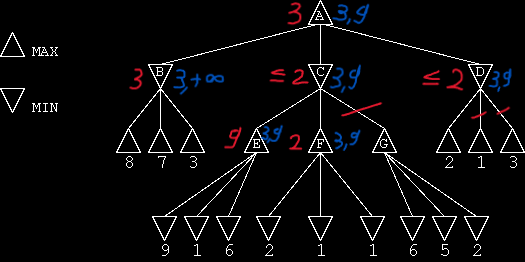

# Spiele

## Handsimulation: Minimax und alpha-beta-Pruning

### 1

A = 3
B = 3
C = 2
D = 1
E = 9
F = 2
G = 6

### 2



### 3

Wenn E und F vertauscht werden, dann wird der Knoten E nicht mehr betrachtet, weil der Min-Knoten C zwei oder kleiner ist und somit der Max-Knoten A niemals in Cs Richtung weiter suchen muss, da B schon größer ist.

## Optimale Spiele: Minimax und alpha-beta-Pruning

[Minimax](minimax.py)
Besuchte Knoten: 549946

[Minimax mit alpha-beta-Pruning](minimax-alpha-bata-pruning.py)
Besuchte Knoten: 18297

Wir besuchen mit alpha-beta-Pruning ca. 3.3% aller Knoten, die wir ohne Pruning besuchen würden.

## Minimax vereinfachen

## Suchtiefe begrenzen

**X Gewinnt**:

```text
X | O | X
---------
O | X |
---------
O |   | X

Value: 1
```

**O Gewinnt**:

```text
O |   | X
---------
O | X | X
---------
O | X | O

Value: -1
```

**Unentschieden**:

```text
X | O | X
---------
O | X | X
---------
O | X | O

Value: 0
```

**Unvollständiges Spiel**:

```text
X | O | X
---------
O |   | X
---------
  |   | O

Value: 3 * 0 + 1 - (3 * 0 + 2) = -1
```

```text
X | O |
---------
  |   | X
---------
  |   | O

Value: 3 * 0 + 2 - (3 * 0 + 2) = 0
```

```text
X | X |
---------
X | O |
---------
  | O | O

Value: 3 * 2 + 0 - (3 * 1 + 1) = 4
```

Diese Bewertungsfunktion schätzt die Position basierend auf potenziellen Gewinnmöglichkeiten für beide Spieler. Die Funktion zählt die Anzahl der Reihen, Spalten und Diagonalen, in denen ein Spieler noch gewinnen kann, und gewichtet sie entsprechend. Das führt dazu, dass beim Alpha-Beta-Pruning die Suche effizienter wird, da weniger Knoten untersucht werden müssen.

## Minimax generalisiert


